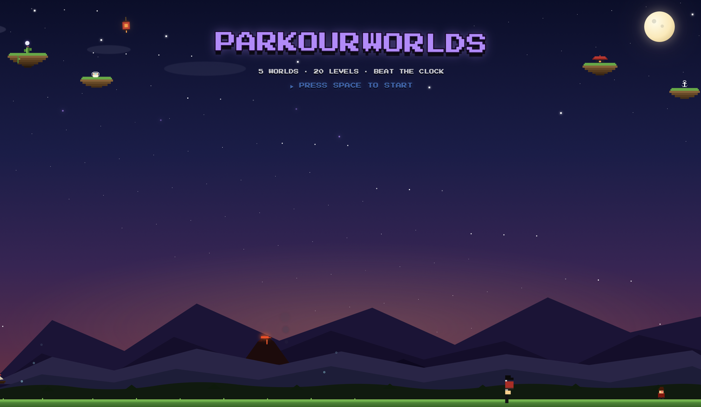

# Parkour Worlds — v3

A pixel-art platformer built with vanilla HTML5 Canvas (no game framework dependencies for the main game file). Race the clock across 8 themed worlds, beat your ghost, collect coins, and conquer the daily challenge.

**[github.com/mohitbisbey-wq/parkour-worlds](https://github.com/mohitbisbey-wq/parkour-worlds)**



---

## What's in v3

| Feature | Details |
|---|---|
| **3 new worlds** | Frozen Peaks, Storm Spire, Crystal Realm — each with a unique mechanic |
| **Ice friction** | Frozen Peaks ground has near-zero stopping friction (0.985 vs 0.72) — slides feel slippery |
| **Wind zones** | Storm Spire levels have directional wind zones that push the player mid-air |
| **Bounce pads** | Crystal Realm spring pads launch the player upward (vy −16) and reset dash |
| **Combo multiplier** | Chain dashes, wall-jumps, stomps, and bounces to build a combo counter on the HUD |
| **Cosmetic skins** | Earn per-world coat colors via achievements; equip from the achievements panel |
| **Parallax backgrounds** | All worlds now scroll background layers at varying depths |
| **3 new enemy sprites** | Yeti (Frozen Peaks) · Gargoyle (Storm Spire) · Crystal Golem (Crystal Realm) |
| **3 new hazard types** | Snowball · Lightning bolt · Crystal shard — one per new world |
| **World select 3×3** | Level select grid expanded from 2×3 to 3×3 to fit all 9 playable worlds |
| **Daily challenge pool** | Expanded from 20 to 32 levels across all 8 main worlds |

---

## What's in v2

| Feature | Details |
|---|---|
| **Per-world enemies** | 6 unique character sprites — Pirate Captain, Ninja, Cowboy, Crab, Rock Golem, Robot |
| **Dash trail** | 7-frame afterimage in world accent color while dashing |
| **HUD diamond** | Dash-ready / active / spent indicator left of the timer |
| **Ghost racing** | Race your personal best as a translucent afterimage |
| **Daily Challenge** | Seeded daily level pick — shareable clipboard result |
| **The Clockwork** | 6th unlockable world with conveyor belts and brass-tinted tiles |
| **Mute** | `M` key or 🔇 button — persists across sessions |
| **Slide mechanic** | Down + move while grounded to slide-dash |
| **Health packs** | Per-level pickups that restore one heart |

---

## Worlds

| # | World | Accent | Mechanic | Levels |
|---|---|---|---|---|
| 1 | ⚓ Pirate Seas | `#2196F3` | — | Harbor Docks · Ship Masts · Jungle Ruins · Kraken Depths |
| 2 | 🥷 Ninja Dojo | `#CE93D8` | — | Rooftop Rush · Bamboo Climb · Pagoda Peak · Shadow Summit |
| 3 | 🌵 Wild West | `#FFCC80` | — | Dusty Trail · Canyon Run · Gold Mine · Dead Man's Pass |
| 4 | 🐚 Deep Ocean | `#80DEEA` | — | Coral Garden · Kelp Forest · The Abyss · The Trench |
| 5 | 🔥 Fire & Brimstone | `#FF7043` | — | Ember Fields · Volcano Climb · The Inferno · The Core |
| — | ⚙️ The Clockwork | `#FFD54F` | Conveyor belts | Gear Up · Factory Floor · Conveyor Chaos · The Machine |
| — | ❄️ Frozen Peaks | `#80D8FF` | Ice friction | Glacier Run · Blizzard Pass · Ice Caverns · The Summit |
| — | ⛈️ Storm Spire | `#90CAF9` | Wind zones | Windy Ledge · Gale Cliffs · Tempest Road · Eye of Storm |
| — | 💎 Crystal Realm | `#E040FB` | Bounce pads | Crystal Entry · Gem Falls · Deep Prism · The Heart |
| — | 🎯 Practice | `#aaaaaa` | — | Test Zone |
| — | 💀 The Gauntlet | `#cc2200` | — | All 5 worlds in one brutal run |

---

## Controls

| Input | Action |
|---|---|
| `WASD` / Arrows | Move |
| `Space` | Jump (coyote time + jump buffer) |
| `Shift` / `Z` | Dash (one per airtime, recharges on land) |
| `S` / Down (while moving) | Slide |
| `M` | Toggle mute |
| `ESC` | Back / menu |
| `A` (world select) | Achievements |

Wall jump: press into a wall and jump.

---

## Run locally

```bash
npm install
npm run dev       # http://localhost:8080
```

The main game file is `public/parkour-worlds.html` — a single self-contained HTML file with all game logic, rendering, physics, and procedural audio. Open it directly in a browser or serve via the dev server.

---

## Stack

- **Game**: Vanilla HTML5 Canvas, no runtime dependencies
- **Build tooling**: webpack 5 (for the Phaser scene files in `src/`)
- **Audio**: Procedural Web Audio API chiptunes — no audio files
- **Tests**: Vitest (`npm test`) — 236 tests covering save/unlock logic and world data

---

## Design system

The v2 visual language is documented in `design/Parkour Worlds Design System-3.zip`:
- `HANDOFF.md` — implementation guide
- `BRAND_GUIDE.md` — color tokens, typography, spacing, motion rules
- `colors_and_type.css` — all design tokens
- `preview/` — 23 visual reference cards
- `ui_kits/parkour-worlds/` — interactive React recreation of all screens

Key tokens: brand purple `#b888ff` · reward gold `#FFD700` · void chrome `#06060f`
